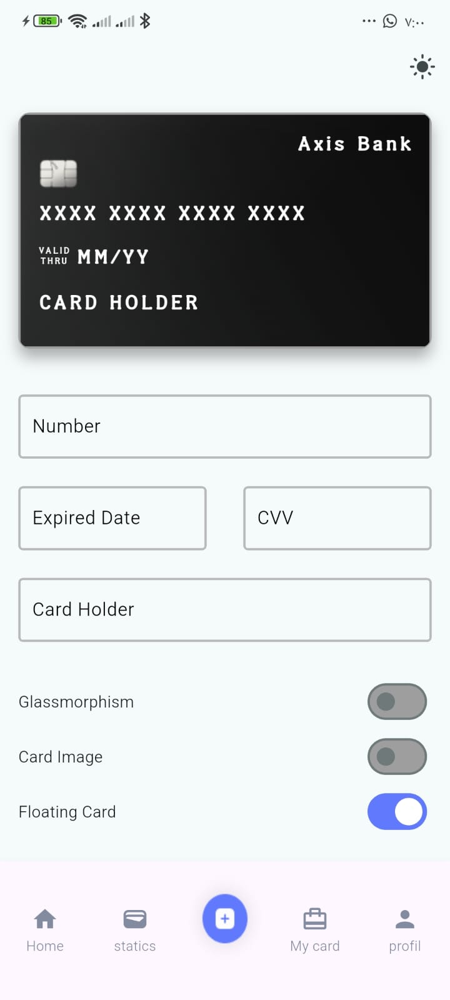
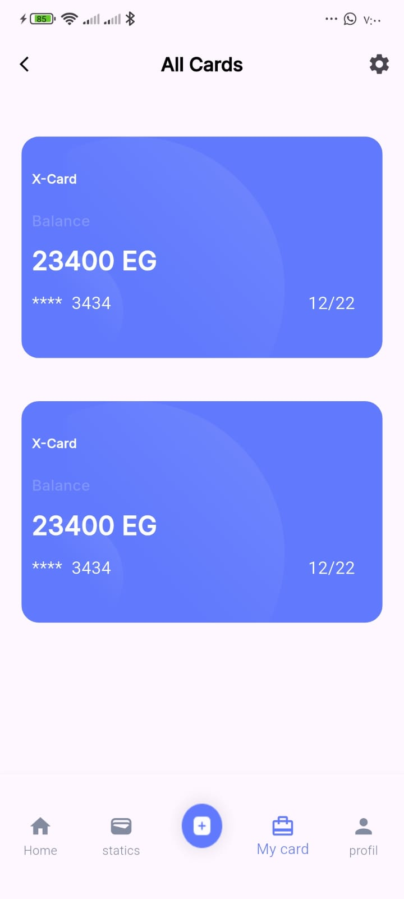
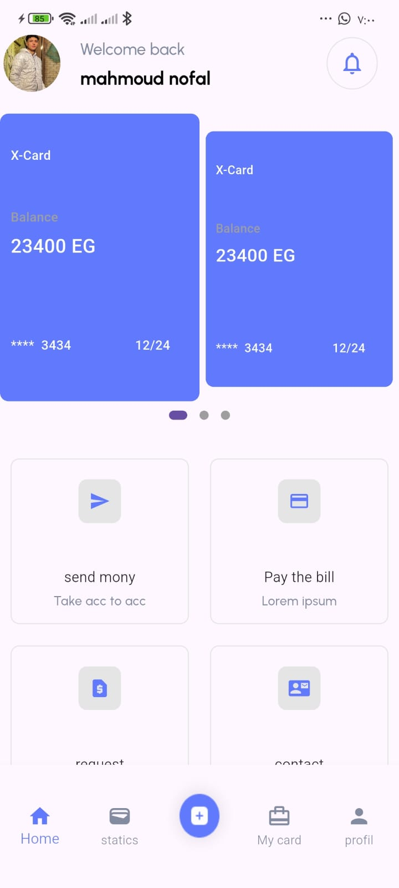
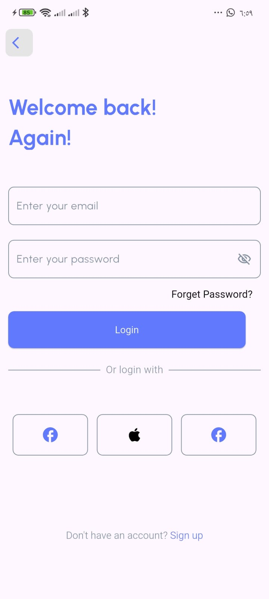
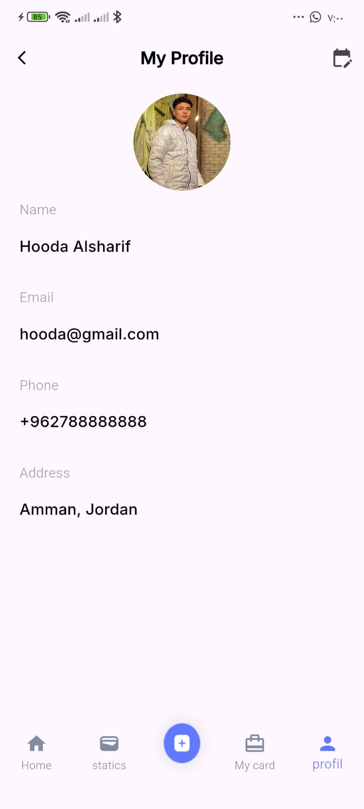
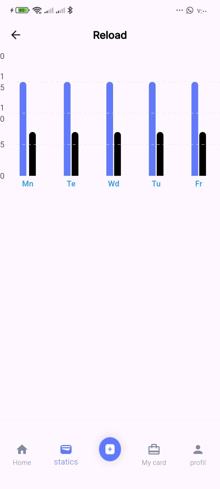

# 💰 Finance UI App (Flutter)

A modern and clean **Finance UI application** built using **Flutter**.  
This project focuses on **UI/UX design**, smooth animations, and responsive layouts.  
It is intended for **portfolio showcase and UI practice**.

---

## 📱 Screenshots

  
  
  
  

  
  
  
  

---

## ✨ Features
- Modern and clean finance UI
- Reusable and well-structured widgets
- Responsive design for different screen sizes
- Smooth UI animations and transitions
- Clean code and scalable structure

---

## 🛠️ Tech Stack
- Flutter
- Dart
- Material Design

---

## 📂 Project Structure
